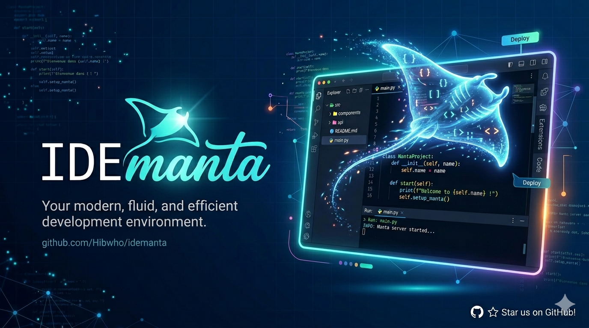
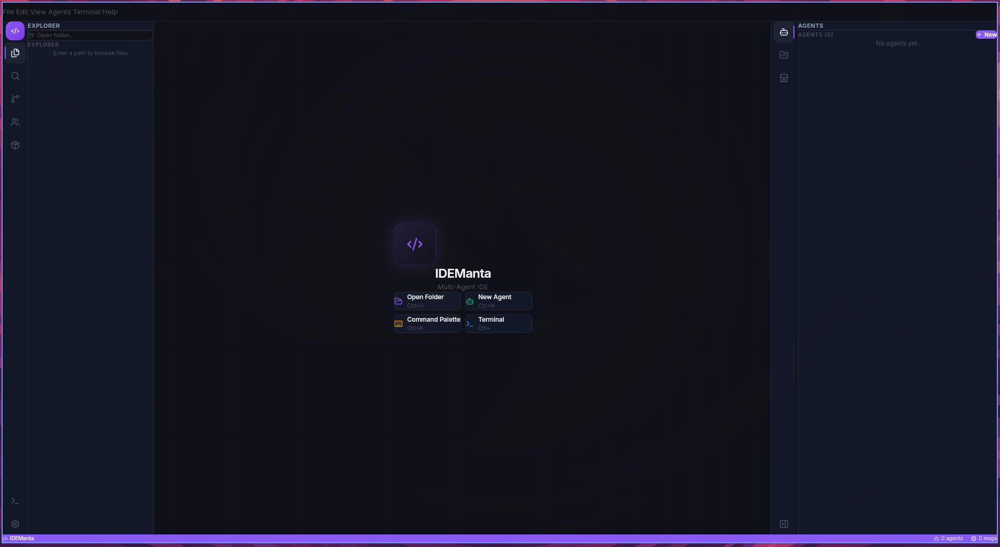
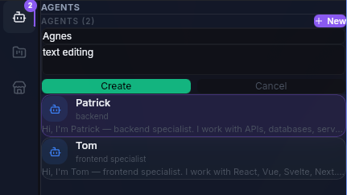
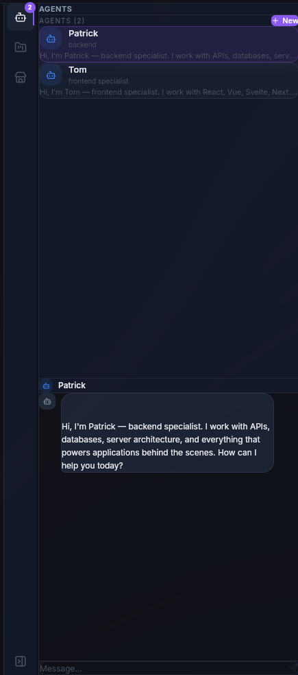
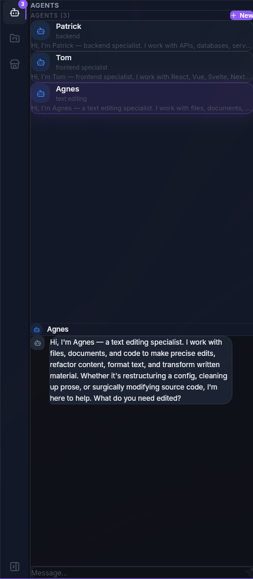
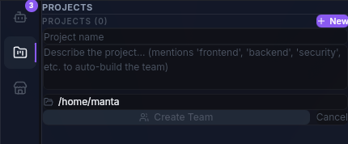
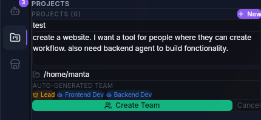
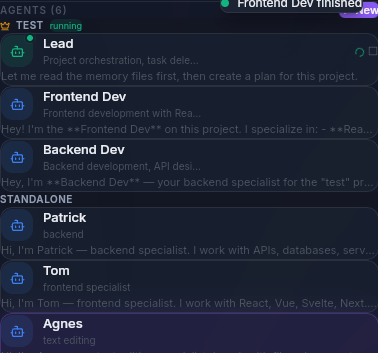

<p align="center">
  
</p>

<p align="center">
  <strong>A multi-agent desktop IDE built for the age of AI coding.</strong>
</p>

---

## Why IDEManta?

Today's AI coding assistants live in the terminal. They're powerful, but using them means constantly switching between your editor, your terminal, and multiple agent sessions. Want three agents working on different parts of your project? Open three terminals. Want to see what they're doing? Switch tabs. Want to edit a file they just created? Open another window.

**IDEManta solves this.** It's a native desktop IDE that wraps AI coding agents directly inside a full-featured editor. No API keys required — it connects to your existing CLI agent and subscription. You get:

- **One window, everything visible.** Editor, file tree, terminal, agents, all in one place.
- **Team Chat.** One unified chat for all your agents. Use `@Patrick` to talk to a specific agent, or just type to talk to the team. Every agent has its own name, color, and personality — like a real dev team in a group chat.
- **Multiple agents, zero tab-switching.** Spawn named agents with different specialities, chat with each of them, see their progress — all from a single panel.
- **No extra cost.** IDEManta wraps your existing CLI agent. If you already have a subscription, you're set. No API keys, no per-token billing.
- **Built for two workflows.** Code readers get Monaco editor with syntax highlighting, git, search. Vibe coders get the Agent View and Team Chat to direct their agents without touching code.
- **Project teams.** Describe your project, IDEManta generates a team of agents — lead orchestrator, frontend dev, backend dev, security auditor — and coordinates them.

Think of it as what would happen if VS Code and an AI agent orchestrator had a baby.

## Screenshots

<p align="center">
  
</p>

<details>
<summary><strong>Agents — Create and chat with multiple AI agents</strong></summary>
<p align="center">
  
  
</p>
<p align="center">
  
</p>
</details>

<details>
<summary><strong>Projects — Auto-generate teams of agents</strong></summary>
<p align="center">
  
  
</p>
<p align="center">
  
</p>
</details>

## Features

- **Team Chat** — One unified chat for all agents. @mention by name to target a specific agent, or broadcast to the team
- **Multi-Agent System** — Spawn named agents with custom specialities, each with their own personality and color
- **Project Teams** — Auto-generate agent teams based on project description
- **Monaco Editor** — Full code editor with custom dark theme, syntax highlighting, auto-save, breadcrumbs
- **Integrated Terminal** — Real PTY terminal with multi-tab support
- **File Explorer** — Tree view with colored file icons, context menu (new file, rename, delete)
- **Git Integration** — Status, stage/unstage, commit from the sidebar
- **Search** — Full-text search across project files with highlighted matches
- **Extension Store** — Browse and install MCP servers, skills, and tools — or search GitHub directly
- **Runtime Manager** — Detect installed languages and tools, create virtual environments
- **Command Palette** — Quick access to all commands (Ctrl+K)
- **Settings** — CLI or API authentication, permission controls
- **Plugin System** — Extensible architecture for custom extensions

## Tech Stack

| Layer | Technology |
|-------|-----------|
| Desktop | Tauri 2 (Rust + Webview) |
| Frontend | React 19, TypeScript, Tailwind CSS v4 |
| Editor | Monaco Editor |
| Terminal | xterm.js + native PTY |
| State | Zustand |
| Icons | Lucide React |
| Build | Vite 7 |

## Keyboard Shortcuts

| Shortcut | Action |
|----------|--------|
| Ctrl+K | Command Palette |
| Ctrl+O | Open Folder |
| Ctrl+S | Save File |
| Ctrl+W | Close Tab |
| Ctrl+Tab | Next Tab |
| Ctrl+\` | Toggle Terminal |
| Ctrl+B | Toggle Right Panel |
| Ctrl+N | New Agent |
| Ctrl+Shift+E | Explorer |
| Ctrl+Shift+F | Search |
| Ctrl+Shift+G | Git |
| Ctrl+Shift+A | Agents Panel |

## Getting Started

### Prerequisites

- [Rust](https://rustup.rs/) (1.70+)
- [Node.js](https://nodejs.org/) (20+)
- [pnpm](https://pnpm.io/)
- An AI coding agent CLI installed and authenticated

### Install and Run

```bash
git clone https://github.com/Hibwho/idemanta.git
cd idemanta
pnpm install
pnpm tauri dev
```

### Build for Production

```bash
pnpm tauri build
```

### Platform Support

| Platform | Status |
|----------|--------|
| Linux (X11 / Wayland) | Fully tested |
| macOS | Supported |
| Windows | Supported |

## Project Structure

```
idemanta/
├── src/                        # React frontend
│   ├── components/
│   │   ├── agents/             # Agent cards, chat, panel
│   │   ├── agentview/          # Visual agent dashboard
│   │   ├── commandpalette/     # Ctrl+K command palette
│   │   ├── editor/             # Monaco editor wrapper
│   │   ├── filetree/           # File explorer + context menu
│   │   ├── git/                # Git status, stage, commit
│   │   ├── menubar/            # Top menu bar with dropdowns
│   │   ├── project/            # Project team management
│   │   ├── runtime/            # Runtime and environment manager
│   │   ├── search/             # File search
│   │   ├── settings/           # Settings modal
│   │   ├── store/              # Extension marketplace
│   │   └── terminal/           # Multi-tab terminal (xterm.js)
│   ├── stores/                 # Zustand state management
│   ├── lib/                    # Persistence, plugins, utilities
│   └── App.tsx                 # Main layout
├── src-tauri/                  # Rust backend
│   └── src/
│       ├── lib.rs              # Tauri commands (PTY, agents, file ops)
│       └── main.rs             # Entry point
└── package.json
```

## Contributing

Contributions are welcome. Fork the repo, create a branch, and open a PR.

## License

MIT
